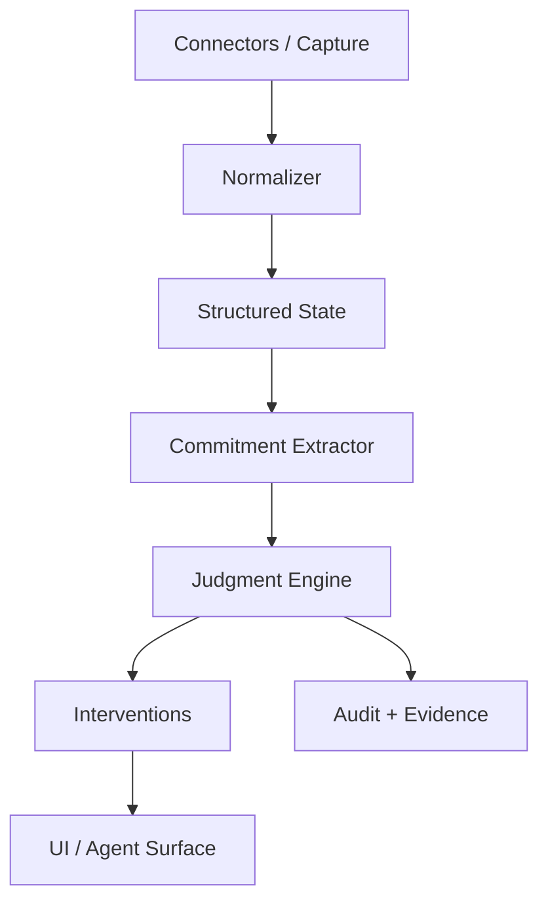

# North

North is a local-first context and judgment layer for personal agents.

Current personal agents can call tools, but they still miss what matters. North turns raw activity from email, calendar, and future integrations into structured commitments, priorities, and evidence-backed interventions.

Example interventions:

- `You owe that recruiter a follow-up.`
- `You have pushed this task three times.`
- `Your calendar does not reflect this week's stated priorities.`

North is being built in the open with three constraints:

- local-first by default
- inspectable evidence behind every intervention
- narrow, high-signal judgments instead of generic assistant noise

## Why This Exists

Most assistant products are good at recall and weak at judgment.

North is not trying to be a universal chatbot. The job is narrower:

- ingest personal activity from trusted sources
- infer commitments and active priorities
- detect drift, neglect, and follow-up risk
- intervene rarely, with evidence

## Current Scope

This repository currently includes a zero-dependency MVP core:

- Google-style message and calendar normalization
- commitment extraction from inbound messages
- three initial judgments:
  - follow-up due
  - repeated deferral
  - priority drift
- fixture-driven demo pipeline
- local file persistence for run artifacts
- Node test coverage for the core judgment loop

## Quick Start

Requirements:

- Node 24+

Run the demo:

```bash
npm run demo
```

Run tests:

```bash
npm test
```

## Architecture



Key design choice:

- North owns the canonical user model.
- External systems such as OpenClaw can supply integrations and runtime surfaces, but they do not define North's memory or judgment model.

More detail: [Architecture Notes](./docs/architecture.md)

## Roadmap

Near-term:

- direct Gmail and Google Calendar ingestion
- richer local persistence for entities, commitments, evidence, and feedback
- a simple intervention feed UI
- explicit feedback actions: confirm, dismiss, snooze, wrong
- optional OpenClaw adapter

Longer-term:

- browser context ingestion with strict permission controls
- more judgments such as relationship neglect and stale founder/investor threads
- pluggable connector and judgment APIs

## Open Source Direction

North is intended to be:

- easy to inspect
- easy to run locally
- easy to extend with new connectors and judgments

If you want to contribute, start here:

- [Contributing Guide](./CONTRIBUTING.md)
- [Architecture Notes](./docs/architecture.md)
- [Roadmap Issue Template](./.github/ISSUE_TEMPLATE/feature_request.md)

## Influences

The repo shape is intentionally biased toward successful OSS patterns:

- strong README first
- clear system boundaries
- runnable local demo
- contributor-friendly extension points

OpenClaw is especially relevant as an ecosystem and product reference for open agent tooling, but North is being built as an independent product with an optional OpenClaw integration path.

## Status

Pre-alpha. The current code proves the judgment loop and repo direction, not the full product.
